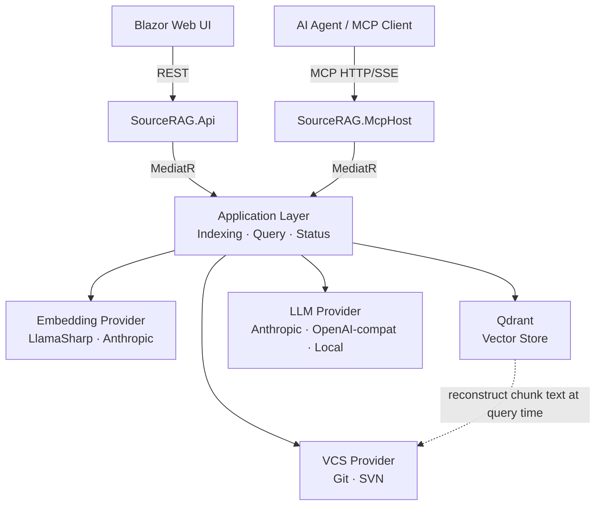

# SourceRAG

A chat-based semantic search engine over source repositories that uses the VCS itself as the proof store — no relational database, no content duplication.

## Why This Exists

Most code RAG systems maintain a separate database to hold chunk text alongside its metadata, so that retrieved vectors can be resolved back to their source. For a source-code target this creates a synchronisation problem: the database drifts from the repository on every commit, requires a schema, and duplicates content that already exists in the VCS. SourceRAG eliminates the proof store entirely — Qdrant holds only vectors and payload coordinates (`revision + filePath + startLine`); chunk text is reconstructed on demand from the repository at query time.

## Architecture Overview



**Indexing:** `GetFilesAtHead` → `GetBlame` → `IChunker` (Roslyn / PlainText) → `IEmbeddingProvider` → `Qdrant.Upsert`

**Query:** `Embed(query)` → `Qdrant.Search` → `VCS.GetFileContent(revision, filePath)` per chunk → LLM call → `QueryResult`

## Key Design Decisions

- **VCS is the proof store.** Qdrant payloads carry `revision + filePath + startLine/endLine`; chunk text is reconstructed on demand at query time via `IVcsProvider.GetFileContentAsync`. No SQL schema, no migrations, no content staleness. → [ADR-002](docs/adr/ADR-002-proof-store-vcs.md)

- **VCS provider and reindex strategy are always registered as a pair.** `IVcsProvider` and `IReindexStrategy` are co-registered in DI — `GitVcsProvider` only with `GitReindexStrategy`, `SvnVcsProvider` only with `SvnReindexStrategy`. Git and SVN use fundamentally different history models (content-addressed hashes vs monotonic revision numbers); allowing mixed registration would cause silent incorrect incremental diffs. → [ADR-001](docs/adr/ADR-001-vcs-abstraction.md)

- **Syntax-aware chunking via Chain of Responsibility.** `RoslynChunker` splits C# files at method / class / property boundaries using the full Roslyn syntax tree. `PlainTextChunker` handles all other files with a sliding window. New language chunkers slot in by implementing `IChunker` and registering before `PlainTextChunker` — no existing code is modified. → [ADR-003](docs/adr/ADR-003-chunking-strategy.md)

- **Dual hosting over a shared Application layer.** `SourceRAG.Api` (REST) and `SourceRAG.McpHost` (MCP over HTTP/SSE) are independent processes with no IPC. The Blazor UI talks REST; VS Code Copilot and other AI agents talk MCP. Both delegate immediately to MediatR — the Application layer has no awareness of its host. → [ADR-008](docs/adr/ADR-008-dual-hosting.md)

- **Embedding and LLM providers are independently configurable at runtime.** `EmbeddingProvider` (`Local` / `Api`) and `LlmProvider` (`Anthropic` / `OpenAiCompatible` / `Local`) are separate config keys. A fully air-gapped deployment — `Local` embedding + `Local` LLM — produces zero outbound network calls. Switching either provider requires only a config change and a full reindex; no code changes, no recompilation. → [ADR-004](docs/adr/ADR-004-embedding-provider.md), [ADR-012](docs/adr/ADR-012-llm-provider.md)

## Tech Stack

| Layer | Choice |
|---|---|
| Language / runtime | C# / .NET 10 |
| Application bus | MediatR |
| VCS — Git | LibGit2Sharp |
| VCS — SVN | SharpSvn |
| C# chunking | Roslyn (`Microsoft.CodeAnalysis.CSharp`) |
| Embedding — local | LlamaSharp (GGUF model, e.g. `nomic-embed-text`) |
| Embedding — API | Anthropic `voyage-code-3` |
| Vector store | Qdrant |
| LLM — cloud (Anthropic) | Anthropic SDK (`claude-3-5-haiku`) |
| LLM — cloud (generic) | OpenAI-compatible endpoint — Groq, Together AI, Mistral, Azure OAI, OpenAI |
| LLM — local | LlamaSharp (GGUF, prompt template auto-detected from model metadata) |
| Web client | Blazor Web (Interactive Server) |
| MCP server | `McpDotNet` over HTTP/SSE |
| Observability | [AiObservability](https://github.com/vvidman/AiObservability) |
| Auth | Azure AD / Entra ID (OAuth 2.0) — bypassed in `Development` |

## Project Status

**In progress.** Core indexing and query pipelines are implemented. Blazor Web UI, REST API, and MCP host are wired and running. Authentication (Azure AD) is in place with a dev bypass. Git and SVN providers, Roslyn chunker, all three LLM provider backends, and the dual embedding provider model are complete.

Next milestone: production hardening — Qdrant collection version migration, observability dashboard, configurable chunker window sizes.

## Getting Started

```bash
git clone https://github.com/vvidman/SourceRAG.git
cd SourceRAG

# Start Qdrant
docker run -d -p 6333:6333 qdrant/qdrant

# Configure the host (minimum required keys):
#   src/SourceRAG.Api/appsettings.json
#
#   "VcsProvider":       "Git"            # or "Svn"
#   "EmbeddingProvider": "Local"          # or "Api"
#   "LlmProvider":       "Anthropic"      # or "OpenAiCompatible" or "Local"
#   "RepositoryPath":    "/path/to/repo"  # local working copy
#   "RepositoryUri":     ""               # SVN only: full trunk URI
#
#   LlamaSharp.ModelPath    — required when EmbeddingProvider = "Local"
#   LlamaSharp.LlmModelPath — required when LlmProvider = "Local"
#   OpenAiCompatible.BaseUrl / .Model — required when LlmProvider = "OpenAiCompatible"

# Environment variables (set as needed):
#   ANTHROPIC_API_KEY       — EmbeddingProvider=Api or LlmProvider=Anthropic
#   SOURCERAG_LLM_API_KEY   — LlmProvider=OpenAiCompatible

dotnet run --project src/SourceRAG.Api

# Optional — MCP server (separate terminal)
dotnet run --project src/SourceRAG.McpHost

# Optional — Blazor client (separate terminal)
dotnet run --project src/SourceRAG.Web
```

**Prerequisites:** .NET 10 SDK · Docker (Qdrant)

> In `Development` mode all three hosts use an allow-all auth policy. For production configure `AzureAd` in each host's `appsettings.json`. → [ADR-011](docs/adr/ADR-011-authentication.md)

## Related Projects

- [RagLab](https://github.com/vvidman/RagLab) — hand-built RAG pipeline in .NET/C#; LlamaSharp + Claude API, dual vector store
- [AiObservability](https://github.com/vvidman/AiObservability) — .NET observability library integrated across all AI pipeline projects
- [Scaffold Protocol](https://github.com/vvidman/ScaffoldProtocol) — human-in-the-loop AI pipeline with structured output validation

## License

Apache License 2.0 — see [LICENSE](LICENSE)
