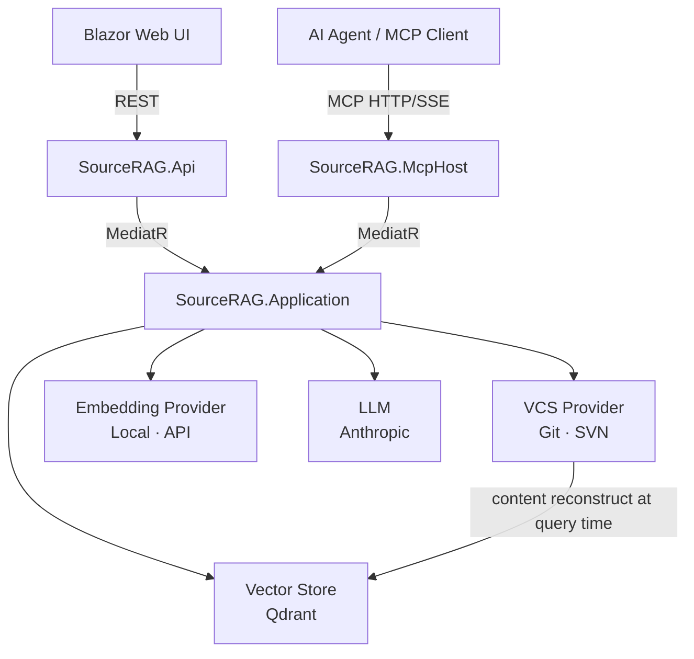

# SourceRAG

A chat-based semantic search engine over source repositories that uses the VCS itself as its proof store — no relational database, no content duplication.

## Why This Exists

Most code RAG systems extract source text into a separate database to serve as the "proof" behind retrieved chunks. For a source code target this creates a synchronization problem: the database drifts from the repository on every commit. SourceRAG eliminates the proof store entirely — the VCS (Git or SVN) is the authoritative content layer, and vectors carry only the coordinates needed to reconstruct a chunk on demand (`revision + filePath + startLine`).

## Architecture Overview



**Indexing:** `GetFilesAtHead` → `GetBlame` → `IChunker` (Roslyn / PlainText) → `IEmbeddingProvider` → `Qdrant.Upsert`

**Query:** `Embed(query)` → `Qdrant.Search` → `VCS.GetFileContent(revision, filePath)` per chunk → LLM call → `QueryResult`

## Key Design Decisions

- **VCS as proof store, not a relational database.** Qdrant payloads carry `revision + filePath + startLine/EndLine`; chunk text is reconstructed on-demand at query time. No SQL schema, no migrations, no content staleness. → [ADR-002](docs/adr/ADR-002-proof-store-vcs.md)

- **Provider + strategy always registered as a pair.** `IVcsProvider` and `IReindexStrategy` are co-registered in DI — `GitVcsProvider` with `GitReindexStrategy`, `SvnVcsProvider` with `SvnReindexStrategy`. Mixing them is impossible at startup. → [ADR-001](docs/adr/ADR-001-vcs-abstraction.md)

- **Syntax-aware chunking via Chain of Responsibility.** `RoslynChunker` splits C# files at method/class/property boundaries using the full Roslyn syntax tree. `PlainTextChunker` handles everything else. New language chunkers slot in without touching existing ones. → [ADR-003](docs/adr/ADR-003-chunking-strategy.md)

- **Qdrant point ID = `sha256(repoPath + filePath + symbolName + revision)`.** Makes upserts idempotent: re-indexing the same content at the same revision is a no-op with no duplicate vectors. → [ADR-006](docs/adr/ADR-006-qdrant-point-id.md)

- **Dual hosting over a shared Application layer.** `SourceRAG.Api` (REST) and `SourceRAG.McpHost` (MCP over HTTP/SSE) are independent processes. The Blazor UI talks REST; VS Code Copilot and other AI agents talk MCP. No IPC, no shared process. → [ADR-008](docs/adr/ADR-008-dual-hosting.md)

- **Embedding provider is a runtime config switch.** `Local` uses LlamaSharp with a GGUF model (no external dependency); `Api` calls the Anthropic embedding endpoint. Switching requires only a config change. → [ADR-004](docs/adr/ADR-004-embedding-provider.md)

## Tech Stack

| Layer | Choice |
|---|---|
| Language / runtime | C# / .NET 10 |
| Application bus | MediatR |
| VCS — Git | LibGit2Sharp |
| VCS — SVN | SharpSvn |
| C# chunking | Roslyn (`Microsoft.CodeAnalysis.CSharp`) |
| Local embedding | LlamaSharp (GGUF model, e.g. `nomic-embed-text`) |
| API embedding | Anthropic `claude-3-5-haiku` embeddings |
| Vector store | Qdrant |
| LLM | Anthropic Claude (via API) |
| Web client | Blazor Web (Wasm / Server) |
| MCP server | `McpDotNet` over HTTP/SSE |
| Observability | [AiObservability](https://github.com/vvidman/AiObservability) |
| Auth | Azure AD / Entra ID (OAuth 2.0) — bypassed in `Development` |

## Project Status

**In progress.** Core indexing and query pipelines are implemented. Blazor Web UI, REST API, and MCP host are wired and running. Authentication (Azure AD) is in place with a dev bypass.

Next milestone: production hardening — configurable chunker window sizes, Qdrant collection version migration, observability dashboard.

## Getting Started

```bash
git clone https://github.com/vvidman/SourceRAG.git
cd SourceRAG

# Start Qdrant
docker run -d -p 6333:6333 qdrant/qdrant

# Set RepositoryPath, VcsProvider, EmbeddingProvider in:
#   src/SourceRAG.Api/appsettings.json

# Run the REST API
dotnet run --project src/SourceRAG.Api

# Run the MCP server (optional, separate terminal)
dotnet run --project src/SourceRAG.McpHost

# Run the Blazor client (separate terminal)
# Set SourceRagApi:BaseUrl in src/SourceRAG.Web/appsettings.json first
dotnet run --project src/SourceRAG.Web
```

**Prerequisites:** .NET 10 SDK · Docker (Qdrant) · Git or SVN on PATH
For `Local` embedding: a GGUF model file (path in `appsettings.json`).
For `Api` embedding: `ANTHROPIC_API_KEY` environment variable.

> In `Development` mode all three hosts use an allow-all auth policy. For production configure `AzureAd` in each host's `appsettings.json`. → [ADR-011](docs/adr/ADR-011-authentication.md)

## Related Projects

- [RagLab](https://github.com/vvidman/RagLab) — hand-built RAG pipeline in .NET/C#; LlamaSharp + Claude API, dual vector store
- [AiObservability](https://github.com/vvidman/AiObservability) — .NET observability library integrated across all AI pipeline projects
- [Scaffold Protocol](https://github.com/vvidman/ScaffoldProtocol) — human-in-the-loop AI pipeline with structured output validation

## License

Apache License 2.0 — see [LICENSE](LICENSE)
